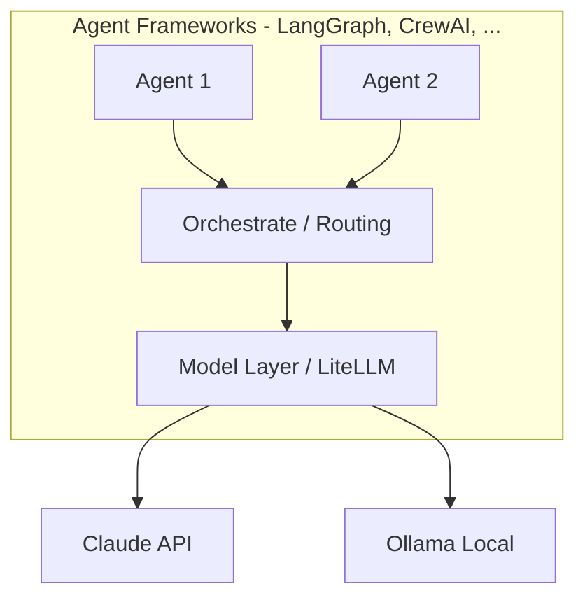
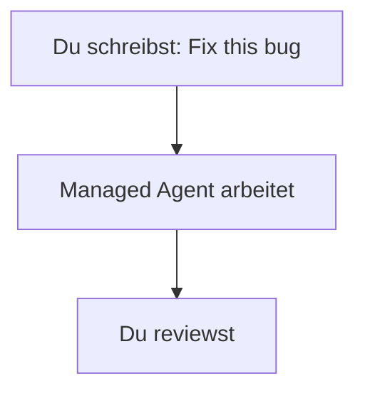
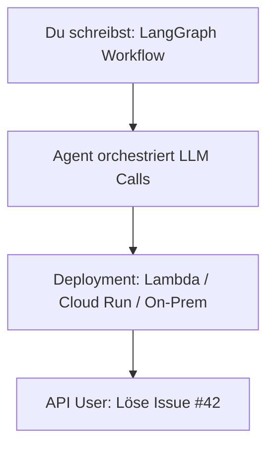
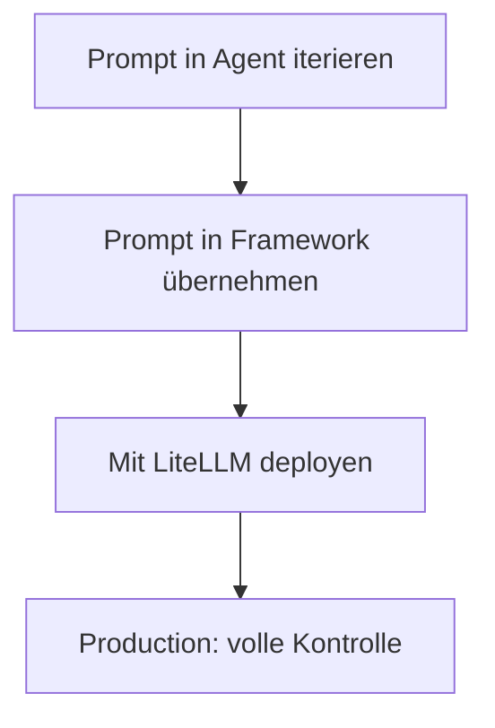
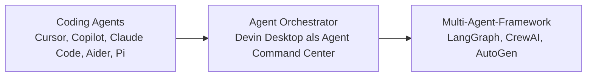
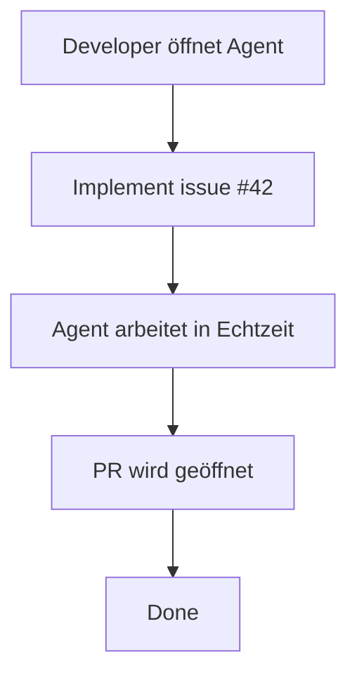
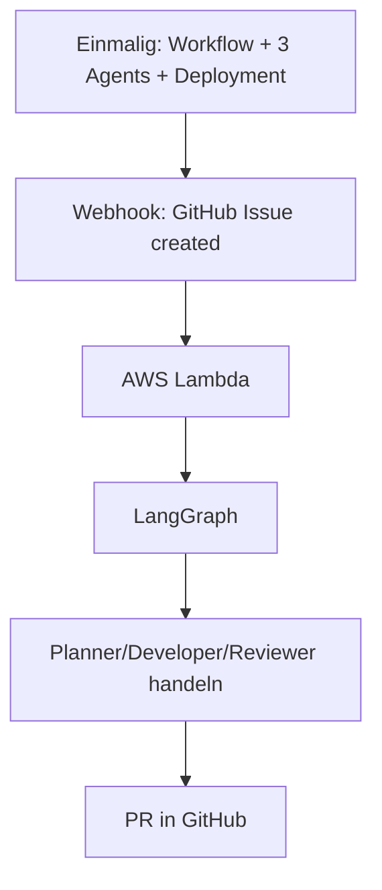
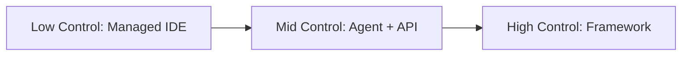
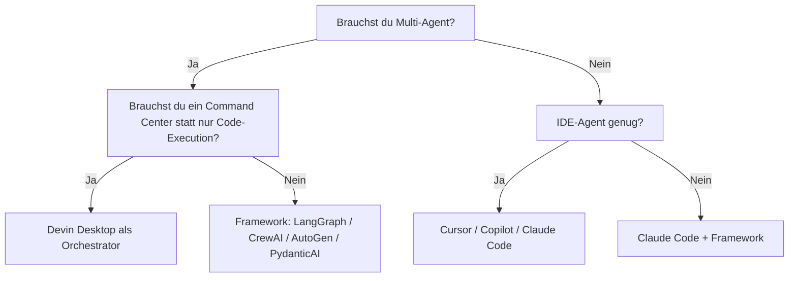
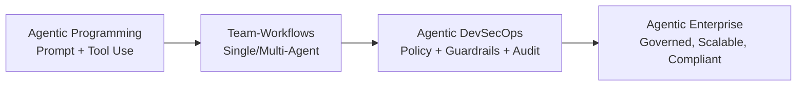

# Agent vs. Framework — Was ist austauschbar?

> ⏱️ 10 Minuten  
> 🎯 Outcome: Verstehen, was du selbst betreibst und was du einkaufst

---

## Zu Beginn: Worüber sprechen wir?

| Konzept | Definition | Beispiele |
|---------|-----------|----------|
| **Coding Agent** | Ein ausführender Agent, der direkt an Code arbeitet (single-session Fokus) | Claude Code, Cursor IDE, Pi Agent, Aider |
| **Agent Orchestrator / Command Center** | Koordiniert mehrere Agents, Sessions und Kontext über Workflows hinweg | Devin, agentische IDEs mit Multi-Agent-Steuerung |
| **Multi-Agent-Framework** | Code-Bibliothek zum Bauen von Orchestrierung (Workflows, State, Tool-Calling) | LangGraph, CrewAI, AutoGen, PydanticAI, Mastra |
| **Model** | Das LLM selbst | Claude 3.5, GPT-5, Qwen3 Coder |

---

## Visualisiert

---

## Der zentrale Entscheidungsbaum

Für dein Projekt: **Welcher Teil gehört dir, welcher nicht?**

### Option A: Managed Agent (IDE-basiert)

**Dir gehört:** Dein Code + deine Prompts  
**Dir gehört nicht:** Der Agent selbst, die Inference

**Beispiele:** GitHub Copilot, Cursor IDE, Claude Code (im IDE- oder CLI-Modus)

**Vorteile:**
- ✅ Sofort produktiv
- ✅ Keine Ops/Infrastruktur
- ✅ Beste UX (IDE integriert)

**Nachteile:**
- ❌ Vendor Lock-in (Cursor-Nutzer?)
- ❌ Keine volle Kontrolle über Agent-Verhalten
- ❌ Model-Wechsel = IDE-Wechsel

---

### Option B: DIY Agent + Framework

**Dir gehört:** Alles (Code, Agent, Workflows, Models)  
**Du brauchst:** Framework + Model-Provider

**Beispiele:** LangGraph, CrewAI, AutoGen, PydanticAI, Mastra

**Vorteile:**
- ✅ Kontrolle über alles
- ✅ Model-agnostisch (Claude → Qwen via LiteLLM)
- ✅ Skalierbarkeit in Production

**Nachteile:**
- ❌ Mehr Code zu schreiben
- ❌ Du brauchst Infra-Know-How (Deployment, Monitoring)
- ❌ Längerer Feedback-Loop beim Entwickeln

---

### Option C: Hybrid

**Kombination:** Nutze IDE-Agent für schnelle Iteration + Framework für Production

**Das ist der pragmatische Weg für fast alle Teams.**

---

## Wichtige Abgrenzung: Agent vs. Orchestrator vs. Framework

- **Coding Agent:** Führt konkrete Entwicklungsaufgaben aus.
- **Orchestrator:** Koordiniert mehrere Agents und Sessions, inklusive Kontext-Sharing.
- **Framework:** Baustein auf Code-Ebene, um eigene Multi-Agent-Systeme zu entwickeln und zu betreiben.

Die wichtige Unterscheidung: Ein Orchestrator ist nicht einfach "noch ein Coding Agent", sondern eine Steuerungsschicht für mehrere lokale oder Cloud-basierte Agents.

---

## Vergleichsmatrix: Agent-IDE vs. Framework

| Aspekt | GitHub Copilot | Cursor | Claude Code | LangGraph | CrewAI | Pi Agent |
|--------|---|---|---|---|---|---|
| **Setup-Zeit** | 5 min (IDE) | 5 min | 5 min | 30 min (Python) | 30 min | 10 min |
| **Model-Wechsel** | Nicht möglich | Eingeschränkt | Nur Anthropic | LiteLLM ✅ | Mehrere Provider | LiteLLM ✅ |
| **Für Production?** | Eher nein | Eher nein | Möglich | **Ja** | **Ja** | Möglich |
| **Kontrolle über Agent-Verhalten** | Gering | Mittel | Hoch | **Maximal** | Maximal | Hoch |
| **Typ** | IDE-Extension | IDE | Web UI + CLI | Python Framework | Python Framework | Python CLI |
| **Self-Host möglich?** | Nein | Nein | Eingeschränkt | **Ja** | **Ja** | Ja |

---

## Ein konkretes Beispiel: "Feature Factory Workflow"

**Szenario:** GitHub-Issue → Automatisch implementiert → PR mit Tests

### Mit Option A (Managed IDE)

### Mit Option B (Framework + DIY)

**Kosten-Nutzen:**
- Option A: 5 Min Pro-Ticket (aber Devs sind blockiert)
- Option B: 4 Std Einrichtung, dann 0 Min pro Ticket (Agents laufen 24/7)

---

## Die wichtigste Entscheidung: Kontrolle

Die passende Lösung hängt davon ab, wie viel Kontrolle dein Team wirklich braucht:

---

## Entscheidungsbaum für dein Team

---

## Warum das für dich wichtig ist

🎯 **Jetzt:** Framework wählen ist strategisch, nicht technisch.  
🎯 **Morgen:** Agenten sind über Teams hinweg austauschbar.  
🎯 **In 6 Monaten:** Dein Agent-Ökosystem ist eine echte Infrastruktur.

---

## Konkrete nächste Schritte

1. **Zeithorizont klären:** Nur für mich (IDE)? Oder Produktions-Workflow?
2. **Kontrolle:** Brauche ich Model-Flexibilität? → dann LiteLLM + Framework
3. **Komplexität:** Will ich 1 Agent oder 5? → dann eher Framework
4. **Team-Fähigkeit:** Python? → Framework. Nicht-Devs? → IDE-Agent.

---

## Kurzer Ausblick: Agentic Enterprise

Hier nur als Orientierung, ohne Deep Dive: Wenn Teams von Agentic Programming Richtung Agentic Enterprise wachsen, werden typischerweise diese Themen wichtig:

- **DevSecOps:** Security und Betrieb früh mitdenken.
- **MLOps:** Modelle, Versionen, Evaluation und Rollout systematisch betreiben.
- **LLMOps:** Prompts, Kontext, Evaluation und Betrieb von LLM-basierten Systemen gezielt steuern.
- **Guardrails:** klare Grenzen für Tool-Nutzung, Datenzugriff und Freigaben.
- **Governance:** Nachvollziehbarkeit, Rollen, Verantwortlichkeiten.
- **Skalierung:** von Einzel-Agenten zu stabilen Team-Workflows.

Für einen späteren Deep Dive in Guardrails ist diese Referenz hilfreich:

- [NVIDIA NeMo Guardrails](https://github.com/NVIDIA-NeMo/Guardrails)

Für die Abgrenzung von MLOps und LLMOps ist diese Referenz hilfreich:

- [ZenML: MLOps vs LLMOps](https://www.zenml.io/blog/mlops-vs-llmops)

Im Curriculum passt dieser Ausblick besonders zu:

- [05-agentic-workflows/security-guardrails.md](../05-agentic-workflows/security-guardrails.md)
- [05-agentic-workflows/secure-software.md](../05-agentic-workflows/secure-software.md)

---

## Weiter navigieren

- **Zurück zur Grundlage:** [Model vs. Agent](model-vs-agent.md) (15 min)
- **Weiter im Workshop-Standardpfad:** [Selection Matrix](../03-coding-agents-landscape/selection-matrix.md) (10 min)
- **Weiter im Architekturpfad:** [Inference Layer mit LiteLLM](../02-models-and-inference/abstraction-layers-litellm.md) (30 min)
